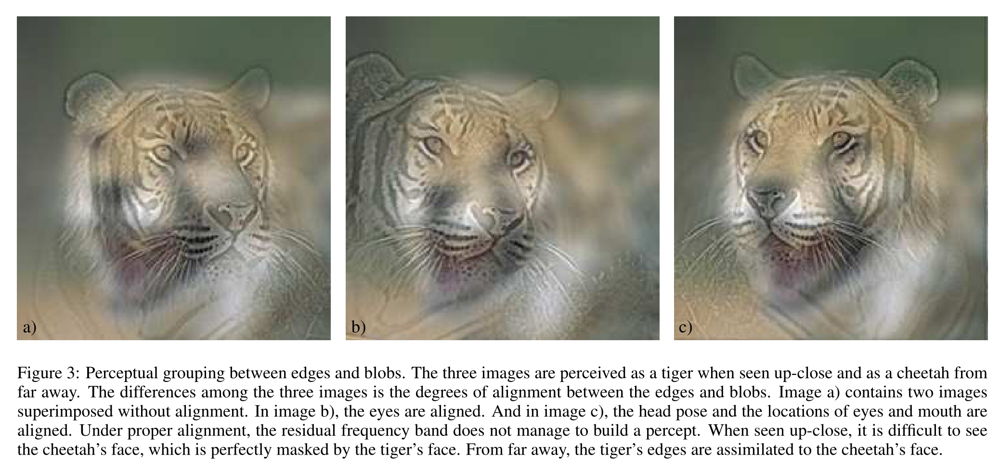
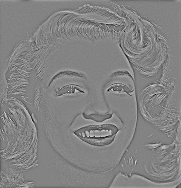
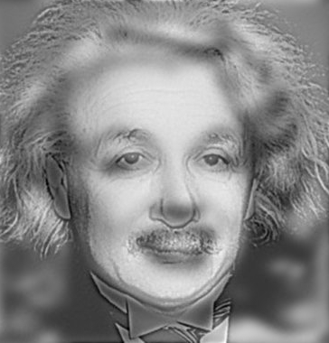

# 《Hybrid Images》论文阅读以及代码实现

论文链接：

1. http://cvcl.mit.edu/publications/OlivaTorralb_Hybrid_Siggraph06.pdf 

2. https://www.researchgate.net/publication/220184425_Hybrid_images

## 论文阅读

### 一、概述

​	先前的研究证明，一副图像的高频信息往往代表着该图像的该图像的细节信息，人类在近距离更容易关注到高频信息，对于图像的低频信息，则是描述着图像的大概轮廓的信息，这是人们在远处看图像的时候所看到的信息。本文通过高、低通滤波器，分别将两个图片进行滤波处理，最终进行混合得到 Hybrid-Image，这样的图片从远处与近处分别看会因为人类的感知而发生差异，表现为看到组成它的两幅图片。

### 二、细节分析

#### 1、人类感知具有灵活性

先前有关于人类视觉感知的研究证明，人类对图像信息的理解是一种多尺度地、整体到局部地分析过程。

正如论文中提到的，Oliva等人的实验通过给参与者在不同播放速度下展示不同频率的图片，发现人类更倾向于先观察能在给定条件下获得最多信息的方式，这一点表现在随着播放速度加快，参与者更倾向于识别低频图片中的全局轮廓而忽略高频的细节信息。

较为反直觉的一点在于，人类并不总是在远处关注于低频信息，而是根据任务的要求对与所关注的信息频段有一定的倾向性。比如问题：图片中是男 or 女？假如此时低频段更能体现性别信息，那么即使在近距离状态下实验者也会有限关注到低频信息，**这说明人类的视觉感知具有灵活性。**

#### 2、混合图片的原理

​	文中大致描述了最终混合图像 ***H*** 的产生公式：
$$
H = I_1 · G_1 + I_2 · (1− G_2),
$$
​	其中，G1、2分别代表与图片对应地低通滤波，在这里(1-G2) 则是高通滤波，文中使用高斯滤波器作为G的实现，**在后续代码中会先将图片通过快速傅里叶变换转化为波，通过滤波器过滤，最终将他们叠加形成新的图片。**

#### 3、纹理对齐对混合效果的影响

​	从文中 Figure.3 混合图片的效果可以看出，纹路和斑点重合对最终的效果影响很大，重合的轮廓会使人类在近处难以分辨低频图片的存在。**所以，在后续的代码中，两张图片中的目标需要进行裁剪和对齐，并且图片中的物体不能在纹理和轮廓上相差过大。**

### 三、查阅资料

#### 1、低通滤波器：

> 任何一个满足一定条件的信号，都可以被看成是由无限个正弦波叠加而成。当在某个时间内信号的变化十分剧烈，其分解得到的正弦波中高频率为主要成分，通过低通滤波器可以过滤掉高频部分，剩余没有被过滤掉的部分重新叠加成一个信号的时候，这个信号很微弱（主分量都被过滤掉了）因此，低通滤波器使得这个剧烈的变化变得“很不剧烈”。

参考： https://blog.csdn.net/maray/article/details/7730388 

#### 2、图像中的高频与低频：

> 低频分量(低频信号)：代表着图像中亮度或者灰度值变化缓慢的区域，也就是图像中大片平坦的区域，描述了图像的主要部分，是对整幅图像强度的综合度量。
>
> 高频分量(高频信号)：对应着图像变化剧烈的部分，也就是图像的边缘（轮廓）或者噪声以及细节部分。 主要是对图像边缘和轮廓的度量，而人眼对高频分量比较敏感。之所以说噪声也对应着高频分量，是因为图像噪声在大部分情况下都是高频的。

参考：https://blog.csdn.net/zaishuiyifangxym/article/details/89452123

#### 四、尚存的疑问

文中提到：

> We use gaussian filters (G1 and G2) for the low-pass and the high-passfilters. We define the cut-off frequency of each filter as the frequency for with the amplitude gain of thefilter is 1/2.

这里为什么采用1/2作为截断点呢，我并不是很清楚。

## 代码实现

这里主要对Github上已有的两个代码实现进行调试和研究，分别是：

+ https://github.com/j2kun/hybrid-images
+ https://github.com/rhthomas/hybrid-images

由于上述代码本身存在缺陷和不方便之处，调试中进行了一定的修改，现已上传我自己的Github仓库：

+ https://github.com/yyxx1997/hybrid-images

其中，包含详细的报告和代码。

### 一、论文对照实现

1. 首先，采用 imageio 第三方库读取图像：

~~~python
import imageio

einstein = imageio.imread("einstein.png", as_gray=True)
marilyn = imageio.imread("marilyn.png", as_gray=True)
~~~

2. 对图像进行滤波处理：

~~~python
def lowPass(imageMatrix, sigma):
   n,m = imageMatrix.shape
   return filterDFT(imageMatrix, makeGaussianFilter(n, m, sigma, highPass=False))

def highPass(imageMatrix, sigma):
   n,m = imageMatrix.shape
   return filterDFT(imageMatrix, makeGaussianFilter(n, m, sigma, highPass=True))

def hybridImage(highFreqImg, lowFreqImg, sigmaHigh, sigmaLow):
   highPassed = highPass(highFreqImg, sigmaHigh)
   lowPassed = lowPass(lowFreqImg, sigmaLow)
   return highPassed + lowPassed

hybrid = hybridImage(einstein, marilyn, 25, 10)
~~~

其中，对与高斯滤波器，其高、低通滤波器的 cut-off frequency 分别为25和10。

3. 高斯滤波器又以下函数进行构造：

~~~python
def makeGaussianFilter(numRows, numCols, sigma, highPass=True):
   centerI = int(numRows/2) + 1 if numRows % 2 == 1 else int(numRows/2)
   centerJ = int(numCols/2) + 1 if numCols % 2 == 1 else int(numCols/2)

   def gaussian(i,j):
      coefficient = math.exp(-1.0 * ((i - centerI)**2 + (j - centerJ)**2) / (2 * sigma**2))
      return 1 - coefficient if highPass else coefficient

   return numpy.array([[gaussian(i,j) for j in range(numCols)] for i in range(numRows)])
~~~

又此函数可以看出，高斯滤波器以一个点为中心，对与原离它的离散点利用像素距离作为计算依据。当**highPass==True** 的时候，采用(1-G)作为返回转化为高通滤波。

4. 对图片进行快速傅里叶变换，并在滤波后转换回图片：

~~~python
from numpy.fft import fft2, ifft2, fftshift, ifftshift

def filterDFT(imageMatrix, filterMatrix):
   shiftedDFT = fftshift(fft2(imageMatrix))
   filteredDFT = shiftedDFT * filterMatrix
   return ifft2(ifftshift(filteredDFT))
~~~

5. 图片被滤波之后变化如下：

   low-passed：

   

   high-passed：

   

6. 图像最终效果：

   